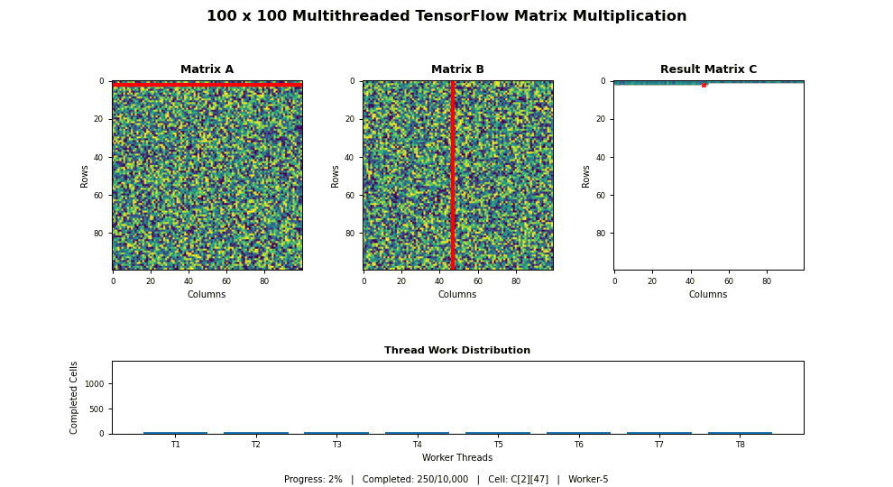

# Operating Systems – Threading Projects

This repository contains two Operating Systems projects that demonstrate the use of **threads, synchronization, semaphores, shared resources, task scheduling, and concurrent execution**.

## Projects

1. **Producer–Consumer Problem using Java Threads and Semaphores**
2. **100 × 100 Matrix Multiplication using Threads and TensorFlow**

---

# 1. Producer–Consumer Problem

## Overview

The Producer–Consumer problem is a classic synchronization problem in Operating Systems.

In this implementation, multiple producer and consumer threads share a common bounded buffer. Semaphores are used to coordinate access to the buffer and prevent problems such as:

- Buffer overflow
- Buffer underflow
- Race conditions
- Simultaneous access to the critical section

The program uses **2 producer threads and 2 consumer threads**.

---

## Features

- 2 Producer threads
- 2 Consumer threads
- Shared buffer of size 5
- Random item generation
- Semaphore-based synchronization
- Mutual exclusion while accessing the buffer
- Producer waiting when the buffer is full
- Consumer waiting when the buffer is empty
- Total produced and consumed item count
- Execution time measurement
- Throughput calculation

---

## Synchronization

Three semaphores are used in the program:

| Semaphore | Purpose |
|---|---|
| `empty` | Keeps track of empty positions in the buffer |
| `full` | Keeps track of filled positions in the buffer |
| `mutex` | Allows only one thread to access the buffer at a time |

Initial semaphore values:

```text
empty = 5
full  = 0
mutex = 1
```

---

## Working

### Producer

```text
Check for empty space
        ↓
Acquire empty semaphore
        ↓
Acquire mutex
        ↓
Add item to buffer
        ↓
Release mutex
        ↓
Signal full semaphore
```

### Consumer

```text
Check for available item
        ↓
Acquire full semaphore
        ↓
Acquire mutex
        ↓
Remove item from buffer
        ↓
Release mutex
        ↓
Signal empty semaphore
```

---

## Sample Output

```text
Producer-1 produced: 45
Buffer: [45]

Producer-2 produced: 73
Buffer: [45, 73]

Consumer-1 consumed: 45
Buffer: [73]

Producer-1 produced: 28
Buffer: [73, 28]
```

When the buffer is full:

```text
Producer-1 is WAITING because buffer is FULL...
```

When the buffer is empty:

```text
Consumer-2 is WAITING because buffer is EMPTY...
```

At the end, the program displays an execution summary:

```text
--------------------------------
        EXECUTION SUMMARY
--------------------------------
Total items produced : 10
Total items consumed : 10
Execution time       : 5.12 seconds
Throughput           : 1.95 items/second
--------------------------------
```

---

## Technologies Used

- Java
- Java Threads
- Semaphore
- AtomicInteger
- Queue
- LinkedList

---

## Running the Producer–Consumer Program

Compile:

```bash
javac ProducerConsumer.java
```

Run:

```bash
java ProducerConsumer
```

---

# 2. Multithreaded Matrix Multiplication using TensorFlow

## Overview

This project performs multiplication of two **100 × 100 matrices** using multiple worker threads.

The calculation is divided into independent result-cell tasks and distributed among **8 worker threads**.

TensorFlow is used to perform the numerical multiplication for every row-column combination.

---

## Matrix Dimensions

```text
Matrix A : 100 × 100
Matrix B : 100 × 100

Result C : 100 × 100
```

The result matrix contains:

```text
100 × 100 = 10,000 result cells
```

Each result cell requires 100 scalar multiplications.

Therefore:

```text
100 × 100 × 100
= 1,000,000 scalar multiplications
```

---

## Features

- Two randomly generated 100 × 100 matrices
- 10,000 result-cell tasks
- 8 manually created worker threads
- Shared task queue
- Shared result queue
- TensorFlow-based computation
- Thread-safe workload statistics
- Execution-time measurement
- Cell-throughput measurement
- Scalar multiplication-rate calculation
- Work distribution among threads
- TensorFlow result verification
- Animated GIF visualization
- Final matrix visualization

---

## Threading Architecture

The program does not create a separate physical thread for every calculation.

Instead, **8 worker threads** repeatedly take tasks from a shared queue.

```text
                    TASK QUEUE
                         |
          C[0][0], C[0][1], C[0][2] ...
                         |
       ---------------------------------------
       |      |      |      |      |        |
       v      v      v      v      v        v
      T1     T2     T3     T4     T5  ...  T8
       |      |      |      |      |        |
       ------------ TensorFlow ---------------
                         |
                         v
                    RESULT QUEUE
                         |
                         v
                  Result Matrix C
```

Each worker:

1. Takes a matrix-cell task from the task queue.
2. Selects the required row from Matrix A.
3. Selects the required column from Matrix B.
4. Performs multiplication using TensorFlow.
5. Stores the calculated value in the result queue.
6. Continues with the next available task.

---

## Matrix Cell Calculation

Each result element is calculated using a row from Matrix A and a column from Matrix B.

For example:

```text
C[i][j]
```

is calculated as:

```text
A[i][0] × B[0][j]
+
A[i][1] × B[1][j]
+
A[i][2] × B[2][j]
+
...
+
A[i][99] × B[99][j]
```

TensorFlow performs the element-wise multiplication using:

```python
tf.multiply()
```

and the values are added using:

```python
tf.reduce_sum()
```

---

## Result Verification

After the threaded computation is complete, the result is independently calculated using TensorFlow:

```python
tf.matmul(tensor_a, tensor_b)
```

The threaded matrix and TensorFlow reference matrix are compared using:

```python
np.allclose()
```

A successful run displays:

```text
Verification : PASSED
```

This confirms that the multithreaded implementation produced the correct matrix.

---

# Animated Output

The animation visualizes the matrix multiplication process and the distribution of work among the worker threads.

It displays:

- Matrix A
- Matrix B
- Result Matrix C
- Selected row from Matrix A
- Selected column from Matrix B
- Corresponding cell in Matrix C
- Work completed by each worker thread
- Overall completion progress

<p align="center">
  
</p>

The GIF replays the recorded order in which the threaded matrix-cell tasks were completed.

---

## Performance Analysis

The program records several performance measurements.

Example:

```text
=================================================================
                    EXECUTION SUMMARY
=================================================================
Total Result Cells      : 10,000
Scalar Multiplications  : 1,000,000
Worker Threads          : 8
Execution Time          : ... seconds
Cell Throughput         : ... cells/sec
Multiplication Rate     : ... operations/sec
TensorFlow Check Time   : ... seconds
Verification            : PASSED
=================================================================
```

---

## Thread Work Distribution

The program also records the number of result cells calculated by each worker.

Example:

```text
Worker-1 : 1248 cells
Worker-2 : 1271 cells
Worker-3 : 1219 cells
Worker-4 : 1263 cells
Worker-5 : 1245 cells
Worker-6 : 1278 cells
Worker-7 : 1227 cells
Worker-8 : 1249 cells
```

The exact values may change between executions because thread scheduling is dynamic.

---

## Technologies Used

- Python
- TensorFlow
- NumPy
- Python `threading`
- `queue.Queue`
- Matplotlib
- Pillow

---

## Installation

Install the required packages:

```bash
pip install tensorflow numpy matplotlib pillow
```

---

## Running the Matrix Multiplication Program

Run:

```bash
python Matrix-multiplication.py
```

After execution, the program generates:

```text
matrix_thread_animation.gif
matrix_thread_summary.png
```

---

# Repository Structure

```text
Operating-system/
│
├── ProducerConsumer.java
├── Matrix-multiplication.py
├── matrix_thread_animation.gif
└── README.md
```

After running the matrix multiplication program locally, the following file is also generated:

```text
matrix_thread_summary.png
```

---

# Operating Systems Concepts Demonstrated

These projects demonstrate important OS concepts including:

- Multithreading
- Concurrent execution
- Thread synchronization
- Semaphores
- Mutual exclusion
- Critical sections
- Shared resources
- Bounded buffer
- Producer–Consumer synchronization
- Worker-thread model
- Task queues
- Thread scheduling
- Workload distribution
- Performance measurement

---

# Conclusion

The **Producer–Consumer project** demonstrates synchronization between multiple producer and consumer threads using semaphores and a shared bounded buffer.

The **Matrix Multiplication project** demonstrates how a large computational task can be divided into smaller independent tasks and distributed among multiple worker threads. TensorFlow is used for numerical computation, while execution statistics and animation help visualize and analyze the threaded execution.

Together, the two projects provide practical implementations of important multithreading and synchronization concepts in Operating Systems.
